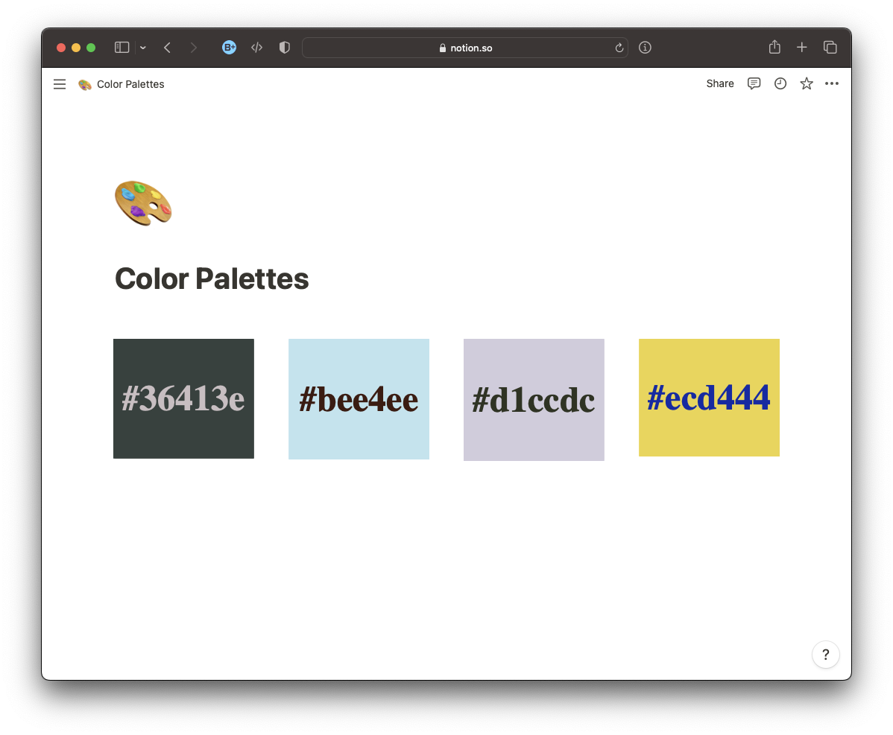

# hex-preview

Quickly view any hex color in the browser. Uses Open Graph Image to generate thumbnail previews for instant messaging, bookmarking, and embedding in documents.

## Usage

The following link displays the color `#00ff00` (green).

https://hex-preview.vercel.app/00ff00

The Open Graph Images on various platforms are shown in the following link, demonstrating the simple sharing functionality.

https://www.opengraph.xyz/url/https%3A%2F%2Fhex-preview.vercel.app%2F00ff00

## Examples

